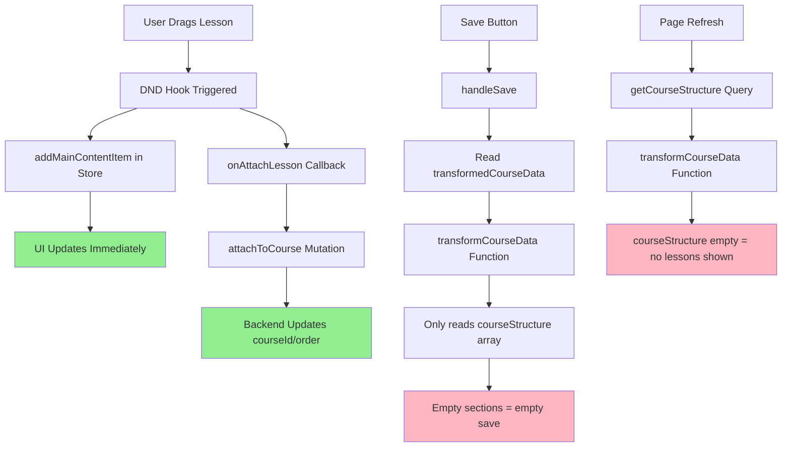

# CourseBuilder State Management Flow Analysis

## Executive Summary

The CourseBuilder V3 system suffers from a **fundamental state synchronization disconnect** between frontend UI state (Zustand) and backend persistence (Convex). This analysis documents the current flow, identifies critical pain points, and provides the foundation for the unified state architecture.

## Current State Management Architecture

### 1. Data Sources (Dual State Problem)

#### Frontend State: Zustand Store

```typescript
// packages/ui/src/CourseBuilderV3/store/useCourseBuilderStore.ts
interface CourseBuilderState {
  mainContentItems: (Lesson | Quiz)[]; // ← PRIMARY UI STATE
  availableLessons: LessonItem[]; // ← SIDEBAR ITEMS
  availableTopics: TopicItem[];
  availableQuizzes: QuizItem[];

  // Actions that modify UI state only
  addMainContentItem: (item: LessonItem | QuizItem) => void;
  reorderMainContentItems: (activeId: string, overId: string) => void;
  initialize: (state: Partial<CourseBuilderState>) => void;
}
```

#### Backend State: Convex Database

```typescript
// Convex Schema
Course {
  courseStructure?: { lessonId: Id<"lessons"> }[]  // ← COURSE LESSON ORDER
}

Lesson {
  courseId?: Id<"courses">  // ← LESSON ATTACHMENT
  order?: number           // ← LESSON POSITION
}
```

### 2. Current Data Flow (Broken Synchronization)



### 3. Critical Disconnection Points

#### Problem 1: Transform Function Only Reads courseStructure

```typescript
// apps/portal/src/app/(root)/(admin)/admin/courses/[courseId]/builder/page.tsx:73-75
function transformCourseData(data: CourseData): CourseStructure {
  // ❌ ONLY reads from courseStructure array
  const orderedLessonIds =
    data.courseStructure?.map((item) => item.lessonId) ?? [];

  // ❌ Ignores lessons attached via courseId but not in courseStructure
  const lessonsById = new Map(
    data.lessons.map((lesson) => [lesson._id, lesson]),
  );

  // ❌ Results in empty sections when courseStructure is empty
  const sections = orderedLessonIds.map(/* ... */).filter(/* ... */);
}
```

#### Problem 2: Store Initialization Doesn't Reflect Backend Changes

```typescript
// apps/portal/src/app/(root)/(admin)/admin/courses/[courseId]/builder/page.tsx:424-430
const mainContentItems = transformedCourseData.modules[0]!.sections.map(
  (section) => ({
    id: section.id,
    title: section.title,
    type: "lesson" as const,
    // ❌ This array is empty when courseStructure is empty
    // ❌ Even though lessons are attached via courseId
  }),
);
```

#### Problem 3: Save Logic Reads from Transformed Data, Not Store State

```typescript
// apps/portal/src/app/(root)/(admin)/admin/courses/[courseId]/builder/page.tsx:210-217
const structure = {
  lessons:
    transformedCourseData.modules[0]?.sections.map((section) => ({
      lessonId: section.id as Id<"lessons">,
    })) ?? [],
  // ❌ Reads from backend-derived data, not current store state
  // ❌ Store has the dragged lessons, but transform doesn't see them
};
```

### 4. Type System Conflicts

#### Store Types vs Convex Types Mismatch

```typescript
// Store types (packages/ui/src/CourseBuilderV3/store/useCourseBuilderStore.ts)
interface Lesson {
  id: string; // ← string
  type: "lesson";
  contentItems: (Topic | Quiz)[];
}

// Convex types (apps/portal/convex/lms/lessons/index.ts)
interface ConvexLesson {
  _id: Id<"lessons">; // ← Id<"lessons">
  courseId?: Id<"courses">;
  order?: number;
  topics: ConvexTopic[];
}
```

#### Transformation Layer Type Issues

```typescript
// Type casting issues in transformation
section.id as Id<"lessons">; // ← Unsafe casting
lesson._id as string; // ← Unsafe casting
```

### 5. Missing Synchronization Mechanisms

#### No Store Updates After Backend Changes

```typescript
// packages/ui/src/CourseBuilderV3/hooks/useCourseBuilderDnd.ts:117-125
if (onAttachLesson && courseId) {
  await onAttachLesson(currentActiveId, courseId, order); // ← Backend updated
}
addMainContentItem(lessonData); // ← Store updated

// ❌ No mechanism to sync store with backend changes
// ❌ No refresh of available lessons after attachment
// ❌ No update of courseStructure after attachment
```

#### No Real-time Subscriptions

- Convex supports real-time subscriptions but they're not utilized
- Store state becomes stale after backend operations
- No automatic re-fetching of course structure

### 6. Error Scenarios

#### Scenario 1: Drag Lesson → Immediate Disappearance

1. User drags lesson from sidebar
2. `addMainContentItem` adds to store → UI shows lesson
3. `onAttachLesson` updates backend courseId → Backend has lesson
4. Store not refreshed → UI shows lesson temporarily
5. Next re-render uses `transformedCourseData` → Empty courseStructure
6. Lesson disappears from UI

#### Scenario 2: Save → Success Toast but Empty Structure

1. User drags multiple lessons
2. Store has lessons in `mainContentItems`
3. User clicks save
4. `handleSave` reads from `transformedCourseData` → Empty structure
5. Saves empty array to courseStructure
6. Shows success toast but nothing is actually saved

#### Scenario 3: Page Refresh → Lost Work

1. User builds course structure in UI
2. Lessons are attached via courseId but not in courseStructure
3. User refreshes page
4. `getCourseStructure` returns empty courseStructure
5. `transformCourseData` shows empty structure
6. All work appears lost

## Root Cause Analysis

### Primary Issue: State Source Duplication

- **Frontend Source**: Zustand store manages UI state
- **Backend Source**: Convex manages persistence state
- **No Synchronization**: No mechanism to keep them in sync

### Secondary Issues

1. **Data Transformation Incompleteness**: Only handles one attachment method
2. **Type System Fragmentation**: Different types for same entities
3. **Missing Real-time Updates**: No live synchronization with backend
4. **Inconsistent Save Logic**: Reads from wrong state source

## Impact Assessment

### User Experience Impact

- ⚠️ **Critical**: Lessons disappear immediately after drag
- ⚠️ **Critical**: Work appears lost on page refresh
- ⚠️ **High**: False success feedback on empty saves
- ⚠️ **Medium**: Inconsistent UI state vs actual data

### Developer Experience Impact

- 🔧 **High**: Complex debugging due to dual state sources
- 🔧 **High**: Type safety issues causing runtime errors
- 🔧 **Medium**: Difficult to reason about data flow
- 🔧 **Medium**: Manual state synchronization required

## Recommended Solution Architecture

### Unified State Management Pattern

```typescript
// Proposed unified hook
const useUnifiedCourseState = (courseId: string) => {
  // 1. Convex real-time subscription as source of truth
  const backendState = useQuery(api.courses.getCourseStructure, { courseId });

  // 2. Zustand store for optimistic updates
  const [localState, updateLocal] = useStore(/* ... */);

  // 3. Synchronization layer
  const syncedState = useMemo(
    () => merge(backendState, localState.optimisticUpdates),
    [backendState, localState],
  );

  // 4. Optimistic update with rollback
  const optimisticUpdate = useCallback((update) => {
    updateLocal(update); // Immediate UI update
    return mutation(update).catch(() => {
      updateLocal(rollback); // Rollback on failure
    });
  }, []);

  return { state: syncedState, optimisticUpdate };
};
```

## Next Steps

1. **Task 1.2**: Design unified state architecture based on this analysis
2. **Task 1.3**: Implement core Zustand store with optimistic updates
3. **Task 1.4**: Implement Convex real-time subscriptions
4. **Task 1.5**: Create unified hook combining both state sources

This analysis provides the foundation for eliminating the state management disconnect and creating a reliable, real-time synchronized CourseBuilder system.
