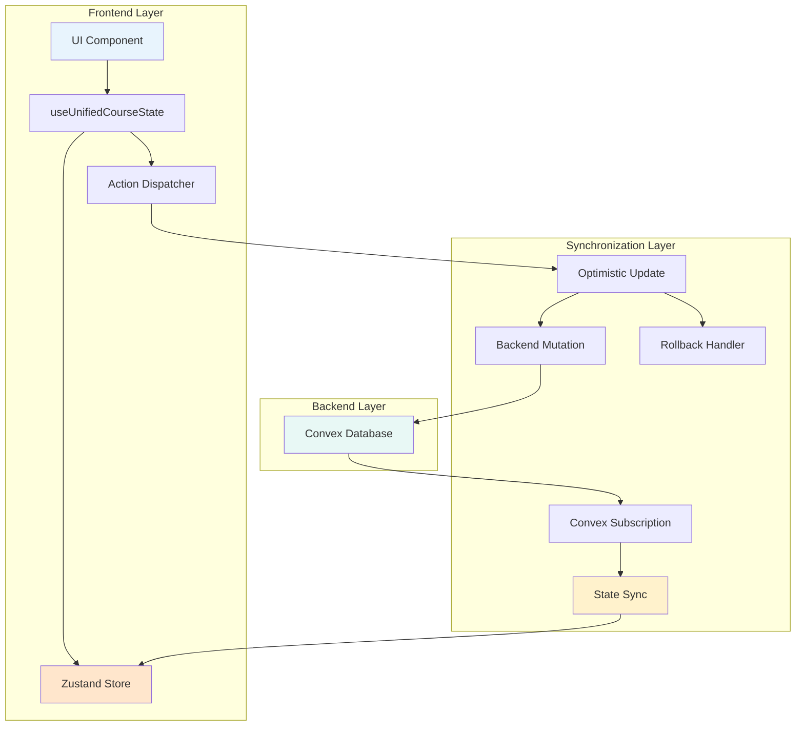

# Unified State Management Architecture for CourseBuilder V3

## Overview

This architecture design eliminates the **dual state source problem** by creating a unified, reactive state management system that combines Zustand's optimistic updates with Convex's real-time subscriptions. The design ensures UI state and backend persistence remain synchronized at all times.

## Architecture Principles

### 1. Single Source of Truth

- **Backend (Convex)** is the authoritative source of truth
- **Frontend (Zustand)** manages optimistic updates and UI state
- **Synchronization Layer** ensures consistency between the two

### 2. Optimistic Updates with Rollback

- UI updates immediately for responsive UX
- Backend changes propagate asynchronously
- Automatic rollback on backend failures

### 3. Type Safety Throughout

- Unified type system across frontend and backend
- No unsafe casting or type mismatches
- Compile-time guarantees for state operations

## Core Architecture Components

### 1. Unified State Hook Structure

```typescript
// Primary hook that components use
const useUnifiedCourseState = (courseId: string) => {
  // Returns: { state, actions, status }
};

// Supporting hooks for specific needs
const useSyncCourseState = (courseId: string) => {
  // Lifecycle management and synchronization
};

const useConvexSubscription = <T>(query: FunctionReference, args: any) => {
  // Generic real-time subscription management
};
```

### 2. State Data Flow



### 3. State Structure Design

#### Unified Course State Interface

```typescript
interface UnifiedCourseState {
  // Core course data
  courseId: string;
  title: string;
  description?: string;

  // Course structure (ordered list of lessons)
  lessons: CourseLesson[];

  // Available items for drag-and-drop
  availableItems: {
    lessons: AvailableLesson[];
    topics: AvailableTopic[];
    quizzes: AvailableQuiz[];
  };

  // UI state
  ui: {
    isDragging: boolean;
    draggedItem?: DraggedItem;
    selectedItems: string[];
    expandedSections: Set<string>;
  };

  // Synchronization state
  sync: {
    isLoading: boolean;
    isSaving: boolean;
    hasUnsyncedChanges: boolean;
    lastSyncedAt: Date;
    optimisticUpdates: OptimisticUpdate[];
  };
}
```

#### Type System Unification

```typescript
// Base types that work across frontend and backend
type UniversalId = string; // Frontend uses string, backend converts to Id<T>

// Unified lesson interface
interface CourseLesson {
  id: UniversalId;
  title: string;
  order: number;
  topics: CourseTopic[];
  // Metadata
  createdAt: Date;
  updatedAt: Date;
}

// Type converters for backend compatibility
const toConvexId = <T extends string>(id: UniversalId): Id<T> => id as Id<T>;
const fromConvexId = <T extends string>(id: Id<T>): UniversalId => id;
```

### 4. Action System Design

#### Action Categories

```typescript
interface UnifiedActions {
  // Course structure actions
  structure: {
    addLesson: (lesson: Partial<CourseLesson>) => Promise<void>;
    removeLesson: (lessonId: string) => Promise<void>;
    reorderLessons: (fromIndex: number, toIndex: number) => Promise<void>;
    updateLesson: (
      lessonId: string,
      updates: Partial<CourseLesson>,
    ) => Promise<void>;
  };

  // Content management actions
  content: {
    attachLesson: (lessonId: string, position?: number) => Promise<void>;
    detachLesson: (lessonId: string) => Promise<void>;
    addTopic: (lessonId: string, topic: Partial<CourseTopic>) => Promise<void>;
    addQuiz: (target: QuizTarget, quiz: Partial<CourseQuiz>) => Promise<void>;
  };

  // UI state actions
  ui: {
    setDragging: (isDragging: boolean, item?: DraggedItem) => void;
    selectItems: (itemIds: string[]) => void;
    toggleSection: (sectionId: string) => void;
  };

  // Synchronization actions
  sync: {
    forceSyncWithBackend: () => Promise<void>;
    retryFailedUpdates: () => Promise<void>;
    clearOptimisticUpdates: () => void;
  };
}
```

### 5. Optimistic Update System

#### Optimistic Update Pattern

```typescript
interface OptimisticUpdate {
  id: string;
  type: "add" | "remove" | "update" | "reorder";
  target: string; // ID of the affected item
  payload: any;
  timestamp: Date;
  status: "pending" | "confirmed" | "failed";
  rollbackData?: any;
}

// Optimistic update implementation
const createOptimisticUpdate = <T>(
  action: string,
  optimisticUpdate: (state: T) => T,
  backendMutation: () => Promise<void>,
) => {
  return async (set: StateSet<T>, get: StateGet<T>) => {
    const updateId = generateId();
    const currentState = get();

    // 1. Apply optimistic update immediately
    const newState = optimisticUpdate(currentState);
    set(newState);

    // 2. Add to pending updates
    const update: OptimisticUpdate = {
      id: updateId,
      type: action,
      payload: newState,
      timestamp: new Date(),
      status: "pending",
      rollbackData: currentState,
    };

    set((state) => ({
      ...state,
      sync: {
        ...state.sync,
        optimisticUpdates: [...state.sync.optimisticUpdates, update],
      },
    }));

    try {
      // 3. Execute backend mutation
      await backendMutation();

      // 4. Mark as confirmed
      set((state) => ({
        ...state,
        sync: {
          ...state.sync,
          optimisticUpdates: state.sync.optimisticUpdates.map((u) =>
            u.id === updateId ? { ...u, status: "confirmed" } : u,
          ),
        },
      }));
    } catch (error) {
      // 5. Rollback on failure
      set((state) => ({
        ...update.rollbackData,
        sync: {
          ...state.sync,
          optimisticUpdates: state.sync.optimisticUpdates.filter(
            (u) => u.id !== updateId,
          ),
        },
      }));

      throw error; // Re-throw for error handling
    }
  };
};
```

### 6. Real-time Synchronization

#### Convex Subscription Management

```typescript
const useConvexSubscription = <T>(
  query: FunctionReference<any, T>,
  args: any,
  options: {
    enabled?: boolean;
    onData?: (data: T) => void;
    onError?: (error: Error) => void;
  } = {},
) => {
  const { enabled = true, onData, onError } = options;

  const data = useQuery(query, enabled ? args : "skip");
  const [error, setError] = React.useState<Error | null>(null);

  React.useEffect(() => {
    if (data && onData) {
      onData(data);
    }
  }, [data, onData]);

  React.useEffect(() => {
    if (error && onError) {
      onError(error);
    }
  }, [error, onError]);

  return { data, error, isLoading: data === undefined };
};
```

#### State Synchronization Logic

```typescript
const useSyncCourseState = (courseId: string) => {
  const store = useStore();

  // Subscribe to backend changes
  const { data: backendState } = useConvexSubscription(
    api.courses.getCourseStructure,
    { courseId },
    {
      onData: (newBackendState) => {
        // Merge backend changes with local optimistic updates
        store.getState().sync.mergeBackendState(newBackendState);
      },
    },
  );

  // Periodic sync to catch any missed updates
  React.useEffect(() => {
    const interval = setInterval(() => {
      if (store.getState().sync.hasUnsyncedChanges) {
        store.getState().sync.forceSyncWithBackend();
      }
    }, 30000); // Sync every 30 seconds

    return () => clearInterval(interval);
  }, [store]);

  return {
    isInSync: !store.getState().sync.hasUnsyncedChanges,
    lastSyncedAt: store.getState().sync.lastSyncedAt,
    forcSync: store.getState().sync.forceSyncWithBackend,
  };
};
```

### 7. Error Handling & Recovery

#### Error Boundary Integration

```typescript
interface StateErrorBoundaryProps {
  children: React.ReactNode;
  fallback?: React.ComponentType<{ error: Error; retry: () => void }>;
}

const StateErrorBoundary: React.FC<StateErrorBoundaryProps> = ({
  children,
  fallback: FallbackComponent = DefaultErrorFallback
}) => {
  const [error, setError] = React.useState<Error | null>(null);

  const retry = React.useCallback(() => {
    setError(null);
    // Trigger state recovery
    useStore.getState().sync.retryFailedUpdates();
  }, []);

  if (error) {
    return <FallbackComponent error={error} retry={retry} />;
  }

  return (
    <React.Suspense fallback={<LoadingFallback />}>
      {children}
    </React.Suspense>
  );
};
```

#### Recovery Mechanisms

```typescript
interface RecoveryActions {
  // Automatic recovery strategies
  retryFailedUpdates: () => Promise<void>;
  forceSyncWithBackend: () => Promise<void>;
  clearCorruptedState: () => void;

  // Manual recovery options
  exportLocalState: () => string;
  importState: (stateJson: string) => Promise<void>;
  resetToBackendState: () => Promise<void>;
}
```

## Implementation Strategy

### Phase 1: Core Infrastructure (Tasks 1.3-1.4)

1. Implement base Zustand store with unified types
2. Create Convex subscription system
3. Build basic synchronization layer

### Phase 2: Optimistic Updates (Task 1.6)

1. Implement optimistic update pattern
2. Add rollback mechanisms
3. Create transaction logging

### Phase 3: Integration (Tasks 1.5, 1.7)

1. Build `useUnifiedCourseState` hook
2. Create lifecycle management hooks
3. Add error boundaries and Suspense

### Phase 4: Testing & Refinement (Task 1.8)

1. Comprehensive testing of all scenarios
2. Performance optimization
3. Documentation and examples

## Benefits of This Architecture

### Immediate Benefits

- ✅ **Eliminates lesson disappearance**: UI and backend stay synchronized
- ✅ **Prevents false save success**: Save reads from actual state
- ✅ **Preserves work on refresh**: Backend is source of truth
- ✅ **Type safety**: Unified type system prevents runtime errors

### Long-term Benefits

- 🚀 **Real-time collaboration**: Foundation for multi-user editing
- 🚀 **Offline support**: Optimistic updates work offline
- 🚀 **Better UX**: Instant feedback with reliable persistence
- 🚀 **Easier debugging**: Single state flow to trace

### Performance Benefits

- ⚡ **Reduced network calls**: Intelligent batching and caching
- ⚡ **Faster UI updates**: Optimistic updates provide instant feedback
- ⚡ **Efficient subscriptions**: Only subscribe to needed data
- ⚡ **Memory efficient**: Proper cleanup and subscription management

## Next Steps

This architecture provides the blueprint for Tasks 1.3-1.8. Each component has been designed to be:

- **Implementable**: Clear interfaces and patterns
- **Testable**: Isolated concerns and dependency injection
- **Maintainable**: Consistent patterns and documentation
- **Extensible**: Foundation for future collaborative features

The architecture solves the core state synchronization problem while providing a foundation for advanced features like real-time collaboration and offline support.
