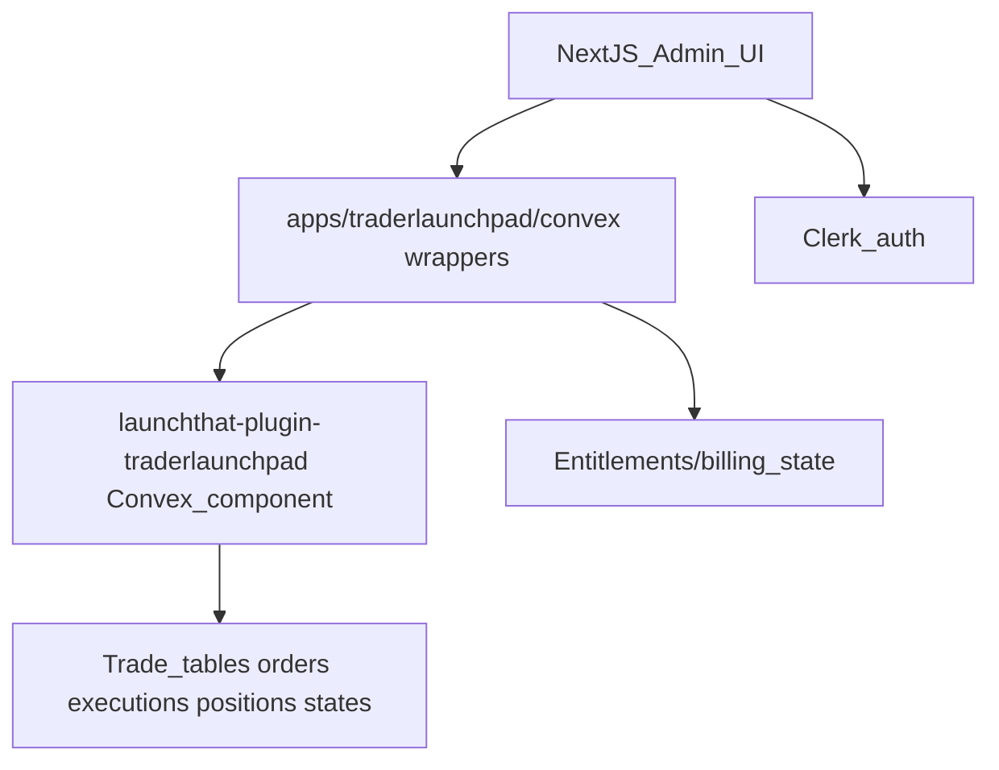

# TraderLaunchpad: Recommended Improvements (UI, Features, Production Readiness)

This document proposes a pragmatic roadmap to make TraderLaunchpad a **paid, production-ready** trading journal/analytics platform. It focuses on **UI quality**, **trader-valued features**, and **production hardening** (billing, tenancy, reliability, security, and observability).

The current architecture is a strong foundation:

- **Standalone app shell**: `apps/traderlaunchpad/` (Next.js + Clerk + Convex client)
- **Shared UI “journal” package**: `packages/launchthat-plugin-traderlaunchpad/src/frontend/journal/`
- **Shared backend**: `packages/launchthat-plugin-traderlaunchpad/src/convex/component/` (Convex component mounted by apps)

---

## Executive summary (2–4 weeks to “paid MVP”)

If the goal is to charge for this platform, the highest leverage work is:

1. **Activation & onboarding funnel**
   - A guided 3-step path: **Connect broker → Sync verified → Review first trade**
   - Reduce time-to-first-value and increase conversion from landing to subscriber.

2. **Paid value: Analytics + review workflow**
   - Traders pay for “insights + habit formation”: stats, tagging, review scorecards, and performance trends.

3. **Reliability + trust**
   - Scheduled sync, sync health UI, clear errors, and auditability.
   - Data correctness beats feature count.

4. **Production scaffolding**
   - Subscription entitlements, gated routes/features, and a secure tokens story (re-enable encryption before production).

---

## Codebase anchors (where improvements attach)

### UI shell / navigation

- Admin shell with tabs: `apps/traderlaunchpad/src/app/admin/layout.tsx`
- Public landing page: `apps/traderlaunchpad/src/app/page.tsx`

### Core “journal” pages (shared plugin UI)

- Dashboard: `packages/launchthat-plugin-traderlaunchpad/src/frontend/journal/pages/DashboardPage.tsx`
- Orders: `packages/launchthat-plugin-traderlaunchpad/src/frontend/journal/pages/OrdersPage.tsx`
- Order detail: `packages/launchthat-plugin-traderlaunchpad/src/frontend/journal/pages/OrderDetailPage.tsx`
- Symbol/instrument trades view: `packages/launchthat-plugin-traderlaunchpad/src/frontend/journal/pages/SymbolTradesPage.tsx`
- Settings + connect/sync: `packages/launchthat-plugin-traderlaunchpad/src/frontend/journal/pages/SettingsPage.tsx`

### Convex component (shared backend)

- Schema: `packages/launchthat-plugin-traderlaunchpad/src/convex/component/schema.ts`
- Sync pipeline: `packages/launchthat-plugin-traderlaunchpad/src/convex/component/sync.ts`
- Data access queries: `packages/launchthat-plugin-traderlaunchpad/src/convex/component/raw/queries.ts`
- Connections: `packages/launchthat-plugin-traderlaunchpad/src/convex/component/connections/*`
- Journal grouping: `packages/launchthat-plugin-traderlaunchpad/src/convex/component/journal/*`

### Standalone app wrappers (single-org mode)

- Wrapper queries/mutations/actions: `apps/traderlaunchpad/convex/traderlaunchpad/*.ts`
  - This layer is a good pattern for production: it injects identity/org context and keeps the UI clean.

---

## Product packaging (what people pay for)

The simplest sellable packaging for traders:

### Free (acquisition)

- Connect broker + manual sync
- Orders list + order detail
- Basic notes on trades (limited)
- Limited history window (e.g., last 30 days)

### Pro (core paid)

- Full analytics + dashboards
- Trade review scorecard + custom tags + setup/playbook mapping
- Screenshots, attachments, and structured journaling
- Advanced filters (symbol, tag, session, date range)
- Scheduled sync + “health” monitoring

### Teams / Mentor (higher ARPU)

- Organizations/workspaces
- Roles: owner/admin/member/viewer
- Shared playbooks, templates, and “mentor review” mode
- Optional Discord/streaming integrations (if desired)

---

## UI/UX improvements (sellable polish)

### 1) Onboarding funnel (reduce drop-off)

Current: Settings page contains connect flow + manual sync.

Recommended:

- Add an onboarding route and flow:
  - `/admin/onboarding/connect`
  - `/admin/onboarding/sync`
  - `/admin/onboarding/first-review`
- Show “success checks”:
  - Connected ✅
  - Sync last run ✅
  - Trades imported ✅
  - Symbol resolution ✅

Code anchors:

- Connect + sync actions: `packages/launchthat-plugin-traderlaunchpad/src/frontend/journal/pages/SettingsPage.tsx`
- Sync + token handling: `packages/launchthat-plugin-traderlaunchpad/src/convex/component/sync.ts`

Acceptance criteria:

- New user can go from login to “I see my latest trade” in < 2 minutes.
- Every failure state shows a clear error + next action.

### 2) Admin navigation & IA

Current: Admin tabs are fixed to Dashboard/Orders/Settings.

Recommended:

- Add **Overview** (home) and separate **Journal** from **Analytics**:
  - Dashboard (Overview)
  - Trades (Orders, Executions, Positions)
  - Review (notes, screenshots, scorecards)
  - Analytics (stats, curves, breakdowns)
  - Settings

Code anchor:

- Tabs rendering: `apps/traderlaunchpad/src/app/admin/layout.tsx`

Acceptance criteria:

- Users can predict where a feature lives without hunting.

### 3) Trade detail polish (make it feel premium)

Current: Order detail shows summary + executions + raw data.

Recommended:

- Replace “raw data” section with:
  - collapsible “Raw payload” dev panel (kept for debugging)
  - derived metrics panel (what traders want):
    - Avg entry/exit, total fees, net position size
    - Realized P&L if derivable
    - Trade duration
    - “Mistakes” checklist + tags
- Add “Review” section:
  - Thesis, setup, outcome, what I’ll do next time
  - Screenshot upload (chart images)

Code anchor:

- `packages/launchthat-plugin-traderlaunchpad/src/frontend/journal/pages/OrderDetailPage.tsx`

Acceptance criteria:

- A trade detail page contains everything needed for a post-trade review in one place.

### 4) Asset (symbol) page as a power feature

Current: `/admin/symbol/[instrumentId]` lists orders/history/executions.

Recommended additions:

- Tabs: Trades / Stats / Notes
- Stats:
  - win rate, avg R, expectancy, profit factor (per symbol)
  - best time-of-day/session performance
- Notes:
  - per-symbol playbook notes + “do/don’t” checklist

Code anchors:

- UI: `packages/launchthat-plugin-traderlaunchpad/src/frontend/journal/pages/SymbolTradesPage.tsx`
- Queries: `packages/launchthat-plugin-traderlaunchpad/src/convex/component/raw/queries.ts`

Acceptance criteria:

- A user can answer “how do I perform on AUDJPY?” in 30 seconds.

### 5) Empty states + “next best action”

Every page should have states:

- Loading
- Empty
- Error
- Success

Recommended:

- Use consistent empty state components with a single CTA.
- Example: No positions → “Sync now” or “Connect TradeLocker”.

Code anchors:

- Dashboard empty states: `packages/launchthat-plugin-traderlaunchpad/src/frontend/journal/pages/DashboardPage.tsx`
- Settings connect states: `packages/launchthat-plugin-traderlaunchpad/src/frontend/journal/pages/SettingsPage.tsx`

---

## Features traders will pay for (roadmap)

### A) Analytics v1 (minimum viable paid analytics)

Metrics:

- Win rate, avg win, avg loss
- Expectancy and profit factor
- Daily/weekly/monthly P&L trend
- Drawdown and equity curve

Implementation notes:

- You can compute analytics in Convex queries or pre-aggregate into tables.
- For production scale, prefer incremental aggregates (per day/per symbol/per setup).

Code anchors:

- Executions and orders tables: `packages/launchthat-plugin-traderlaunchpad/src/convex/component/schema.ts`
- Execution normalization: `packages/launchthat-plugin-traderlaunchpad/src/convex/component/sync.ts`

### B) Review workflow (habit formation)

- Trade “scorecard” (1–5): plan, execution, risk, psychology
- Tagging: setup tags, mistake tags
- Screenshot uploads
- “Playbook” setups: name, rules, checklist, example trades

Data model suggestion (Convex component):

- `tradeNotes` table keyed by `(organizationId, userId, externalOrderId|tradeIdeaGroupId)`
- `playbooks` and `playbookSetups` tables
- `tradeTags`/`mistakes` as arrays or join tables

### C) Risk tooling (sticky + valuable)

- Position sizing calculator (risk %, stop distance)
- Daily loss limit + max trades/day
- “Guardrails” alerts: notify and optionally lock “Sync / Trade review only”

### D) Filtering/search (reduces churn)

- Global search: symbol, tag, date, setup
- Saved filters (“My London session AUDJPY”)

---

## Monetization: subscriptions + entitlements

You need a clear “entitlement state machine”:

- `free` | `trial` | `pro` | `past_due` | `canceled`

Recommended architecture:

- Billing provider (Stripe is typical) emits webhooks to a public endpoint.
- Webhook handler updates `entitlements` table in Convex (or your DB layer).
- UI checks entitlements to show upgrade gates and restrict premium features.

Acceptance criteria:

- User cannot access Pro analytics without `pro` entitlement.
- Downgrades immediately remove access.
- Billing failures show a clear in-app banner.

Code anchors:

- Client routing and shells: `apps/traderlaunchpad/src/app/*`
- Convex functions live in `apps/traderlaunchpad/convex/*` and the component.

---

## Production readiness (non-negotiable)

### 1) Tenancy: move beyond single-org env var

Current: single-org-by-default works for MVP, but not for Teams.

Production path:

- Add first-class orgs/workspaces with membership + roles.
- Update `resolveOrganizationId` to derive org from Clerk org claims or your own mapping table.

Acceptance criteria:

- Every data query is scoped by `(organizationId, userId)` (already trending that way).
- Users can’t see each other’s data across orgs.

### 2) Security: token encryption before production

Current: you temporarily used plaintext tokens to debug; production must return to encryption.

Production requirements:

- End-to-end WebCrypto encryption/decryption (consistent across app + component).
- Key rotation plan.
- Rate limiting for connect/sync actions.

Code anchors:

- Token handling & refresh: `packages/launchthat-plugin-traderlaunchpad/src/convex/component/sync.ts`
- Standalone wrappers: `apps/traderlaunchpad/convex/traderlaunchpad/actions.ts`

### 3) Reliability: scheduled sync + health UI

Recommended:

- Add scheduled/cron sync for connected users.
- Lease/lock for sync (avoid double-sync) + retry backoff.
- “Sync health” UI on Dashboard:
  - last success, last error, next scheduled
  - token status (expired/refresh ok)

Code anchors:

- Sync action: `packages/launchthat-plugin-traderlaunchpad/src/convex/component/sync.ts`
- Connection metadata: `packages/launchthat-plugin-traderlaunchpad/src/convex/component/schema.ts`
- Dashboard polling display: `packages/launchthat-plugin-traderlaunchpad/src/frontend/journal/pages/DashboardPage.tsx`

### 4) Observability & audit trails

Must have:

- Structured logs for connect/disconnect/sync attempts.
- Persist “sync runs” table:
  - startedAt, finishedAt, status, counts, error message
- Audit logs for security-sensitive actions.

### 5) Performance considerations

- Prefer indexed queries (no table scans).
- Add per-symbol and per-day rollups if analytics queries become heavy.
- Paginate long lists (orders/executions).

---

## Suggested milestones & acceptance criteria

### Milestone 1: Paid MVP Launch (2–4 weeks)

- Subscription entitlements + gating implemented
- Onboarding funnel implemented
- Dashboard “sync health” and error UX
- Trade detail review notes + tags (basic)

Acceptance criteria:

- User can subscribe, connect broker, sync, and review a trade in one flow.
- No silent failures: all errors are actionable.

### Milestone 2: Analytics v1 (4–6 weeks)

- Stats: win rate, expectancy, profit factor
- Equity curve + drawdown
- Asset stats page

Acceptance criteria:

- Analytics match imported execution data and are reproducible.

### Milestone 3: Teams & Mentor (6–10 weeks)

- Orgs/workspaces + roles
- Shared playbooks + mentor review
- Optional integrations (Discord streams, etc.)

Acceptance criteria:

- Proper isolation between orgs.
- Role-based permissions enforced server-side.

---

## Architecture diagram (where the work sits)

